# Persistent Homology: A Non-Mathy Introduction with Examples
## Using TDA Tools in Data Science 

Working at a company full of Topologists, I have routinely needed to write and interpret tools from the world of Topological Data
Analysis (TDA). TDA lives in the world of algebraic topology, a blending
of algebra and topology concepts from mathematics. Abstract Algebra was never my strong suit, nor have I ever taken a topology class, so I created the following non-mathy explanations and use cases to explain the concepts from one of the tools I frequently use, *persistent homology*.

## Persistent Homology

Broadly, the focus of persistent homology is:

**As one increases some threshold, how does the connectivity of a set of points change?**

The math linking the many uses of persistent homology described here is deep, and not covered in this write-up. What's important to note here though is that the different uses we will describe here have drastically different intuitive meaning. We will look at different meanings / uses with respect to:

- dimension of persistent homology (e.g. 0d persistent homology, 1d persistent homology, $n$-d persistent homology)

- the type of data (e.g. signals vs discrete Euclidean points)

- what it means for two points to be "close" (e.g. height filtration)

This is by no means a comprehensive summary of what will be discussed below. These distinctions will be made clear through examples and detailed descriptions of how to use / interpret the results.

## Euclidean Data

This section looks at several dimensions of persistent homology with Euclidean data (e.g. sets of $n$-dimensional separate points). Note that this entire discussion and the computations therein would also hold for sets of points in other metric spaces (for example, Manhattan distance).

## 0d Persistent Homology

0d persistent homology in Euclidean space can best be explained as growing balls simultaneously around each point. The key focus of 0d persistent homology here is *connected components*-- as the balls around the points expand, 0d persistent homology notes when the balls touch.

Let's visualize this concept. Here, we use an example of two noisy clusters and assess connectivity as we increase the radius of the balls $\tau$ around each point:

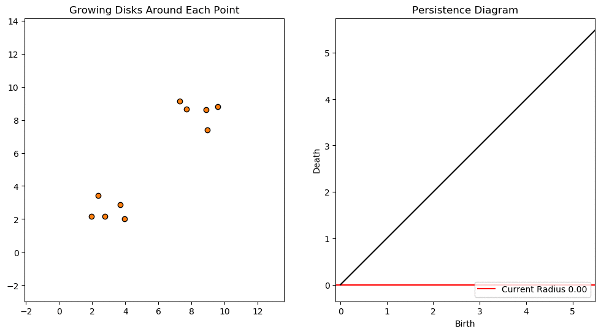

Let's go through what happens as we sweep our threshold $\tau$ from $-\infty$ to $\infty$.

Nothing happens for negative values of $\tau$ (there are no balls with a negative radius).

The first interesting value of $\tau$ is $0$. At $0$, a connected component for each point is *born*-- each one of these is represented by a ball with none of the balls intersecting.

0d persistent homology is tracking when these balls intersect. More specifically, it records when the ball in one *connected component* first intersects a ball of a *different* connected component. When we get our first set of two balls touching, which we call ball $A$ and ball $B$, they will become part of the same connected component. We will therefore have our first *death* of a connected component, and thus our first point on the *persistence diagram*. The normal precedent for persistent homology is when two balls touch, the ball born sooner lives; however, with all the points born at $0$ here, we will simply choose which point dies by index value. So we will say ball $A$ "dies" and has its (birth, death) pair added to the persistence diagram. As these two balls' radii continue to increase and either of the balls corresponding to $A$ or $B$ hits the ball for point $C$, the $AB$ connected component will merge with the $C$ connected component, causing one of the components to die and adding the second point on the persistence diagram.

This process can be made more clear by showing the same diagram, but assigning different colors to different connected components as we go:

This diagram more clearly shows that when the ball of any point in a single connected component hits the ball of another point from another connected component, the components merge, with one color persisting and the other color vanishing. Each color vanishing corresponds to a death and therefore another point being added to the persistence diagram.

Let's focus on a specific aspect of this example. To the eye, it should be clear these data have some semblance of two noisy clusters. This leads to predictable effects on the persistence diagram. As the disks grow from $0$ to $0.66$, we see multiple (birth, death) pairs quickly appearing on the persistence diagram on the right. This should not be surprising-- points close to each other quickly touch as each disk's radius increases.

Once we reach $0.66$, however, we see on the left that the disks in each cluster are connected into two disjoint clusters (light blue and orange). Thus, these components have room to grow without touching a disjoint component, leading to no additional deaths for a while and thus a pause in new points appearing on the persistence diagram.

Eventually, though, when we increase $\tau$ such that these two clusters then touch at radius $3.49$, one of the clusters dies (in this example, light orange), which creates the *last* (birth, death) pair on the persistence diagram.

As $\tau$ goes beyond $3.49$, all of the balls are already touching. Thus, the balls will never hit any other balls not already connected to themselves, meaning there cannot be any additional deaths (e.g. no more points on the persistence diagram).

(Some choose to have an additional (birth, death) pair with a death value of $\infty$, but this is a more subjective decision.)

As we discussed above, the noisiness of the clusters leads to the values on the persistence diagram closer to $0$, and the separation of the two clusters leads to the separate, higher persistence value at $3.49$. Thus, there is a special significance on persistence diagrams to *gaps* between (birth, death) pairs closer to $0$ and any points above. In particular, this gap signifies the extent to which data is clustered relative to its noisiness. For the picture above, a larger gap between that top persistence value and the lower persistence values would be generated if we further separated the two noisy clusters. Similarly, if we pushed the noisy clusters closer together, that gap would shrink.

Another way that this gap in persistence values could increase is if the noise of each cluster decreases. To emphasize this point, below is an example of random data converging to two clusters. More precisely, on the left we see a *time series of point clouds*, where we start with random data, and we move forward into time until the point cloud consists of two points. The right shows the corresponding 0d persistence diagrams:

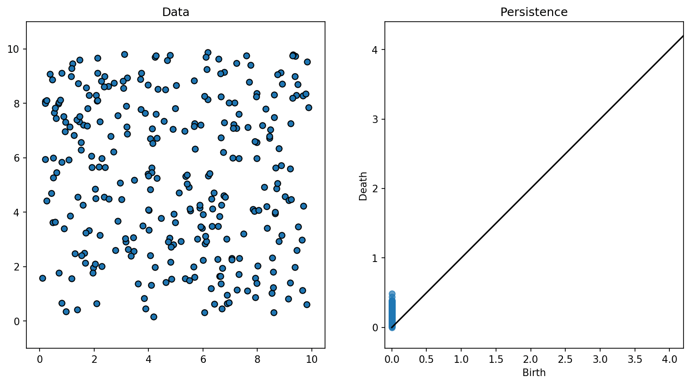

When we have random data, there is no high persistence value away from the noisy values around $0$ in the persistence diagram.

As the data begin to separate, however, we see one increasingly persistent point separate from the persistence values corresponding to noise.

Also note the persistence values from noise move toward 0 as the data converge to two points. Not only do the clusters become more distinct as the data converge to two points, as represented by the increasing gap between the most persistent point and the rest of the points on the persistence diagram, but also the noise itself becomes less noisy as the distance between points within a given cluster converges to $0$. Once the data converge to the two points, all the points are born at $0$, but *within* each cluster, the points immediately merge as the disks grow even a tiny amount.

#### Why use 0d persistent homology over K-means

The K-means clustering algorithm is particularly popular, so it's worth taking a moment to emphasize the additional information gathered by 0d persistent homology that would be lost using K-means.

To start, it should be clear that one run of K-means for some $k$ clearly keeps less information than running 0d persistent homology. In particular, running K-means for $k=2$ tells you nothing about the stability of $2$ clusters relative to any other number of clusters, whereas 0d persistent homology offers a measure of cluster robustness in the separation of values on the persistence diagram.

K-means does offer some solution to this, for example by searching for the [elbow point](https://en.wikipedia.org/wiki/Elbow_method_(clustering)), which explores the trade-off between reduction in error and number of clusters. Of course, this involves multiple runs of K-means, and to explore as many options as can be explored by 0d persistent homology, one would have to run it for $k=1$ through $k=$ number of data points.

Additionally, recall that the results from K-means are not necessarily stable, or, in other words, running K-means twice with the same parameters comes with no guarantees of equivalent answers, a potentially problematic caveat for unsupervised machine learning. 0d persistent homology, on the other hand, is a stable result. Furthermore, 0d persistent homology comes with some nice 
[mathematical proofs](https://link.springer.com/article/10.1007/s00454-006-1276-5) 
of robustness to noise.

### 1d Persistent Homology

With 1d persistent homology, we still blow up balls around points, just as we were doing with 0d persistent homology. Here, however, we keep track of a subtler notion of connectivity between points. Instead of just tracking connected components, we now pick up on when *loops*  form and disappear. Truth be told, a rigorous definition of a *loop* requires more math than appropriate for this document (see [Munkres' algebraic topology book](https://www.amazon.com/Elements-Algebraic-Topology-James-Munkres-ebook/dp/B07B87W7JL) for more), but the intuitive meaning will hopefully be clear from this example.

Consider the figure below of a noisy circle of data:

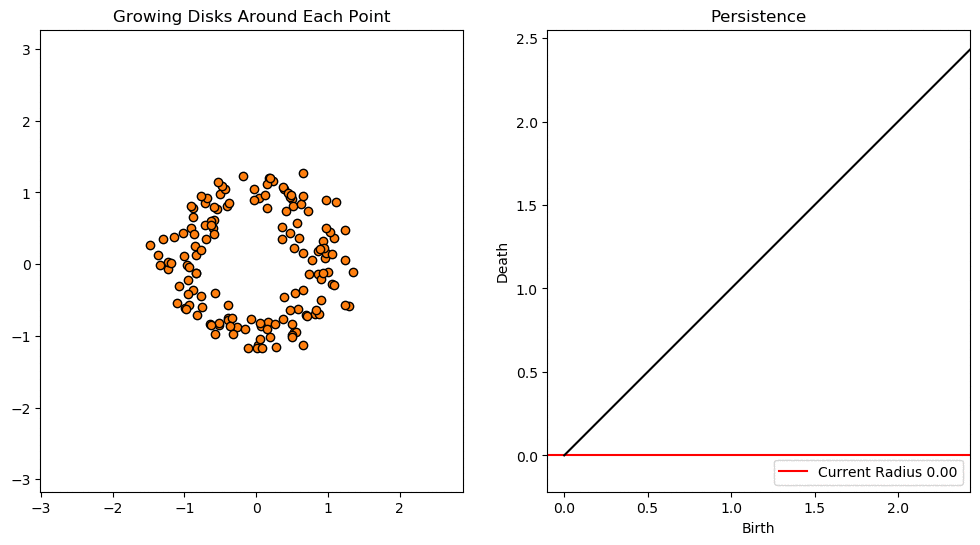

There is one point of particular importance that forms on this persistence diagram. Note on the left that a ring forms around $0.25$ (the pause in the middle of the gif). At this moment, the mathematical formalism enables us to say that a single loop has formed which encloses the white space inside the ring.
As the threshold increases, the ring thickens, thus shrinking the white space, until finally the growing disks eventually
fill in the interior of the ring around $0.6$. Thus the loop is *born* at $0.25$ and its $death$ occurs at $0.6$, giving us the high outlier 1d persistence value on the right.

As for the noisy persistence values on the diagonal, at very low persistence values, there are brief instances of loops forming early on, the most notable being around the location $(-1, 0)$ in the figure on the left. These loops have a small radius and are thus quickly filled in by the expanding disks, leading to death values close to their birth values and therefore creating points on the persistence diagram close to the diagonal.

Another way of looking at 1d persistent homology is to make the data "more loopy." Below we take a grid of points and force it into three loops:

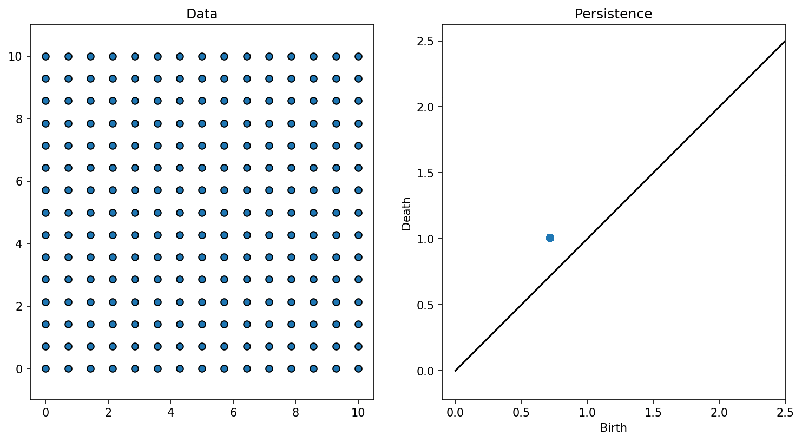

To start, it should not be surprising that we eventually have three highly persistent points which correspond to the three loops. One important qualifier comes from this though. Let's focus on the smallest circle in the top right. It's corresponding 1d persistence value settles at roughly $(0.3, 0.9)$ on the persistence diagram. Note that the value on the persistence diagram moves up from the diagonal as the interior of the circle empties. It then stabilizes even while there are still points outside the circle converging to the loop. We are learning something about the behavior / robustness inside the loop, but *1d persistent homology makes no guarantees about that data being a circle*.

We can emphasize this point further with a static example. The two datasets used below consist of one set of points spanning a circle, and a second set of points using the same circle data with an additional grid of points outside the circle. Compare the two persistence diagrams resulting from the two datasets below:

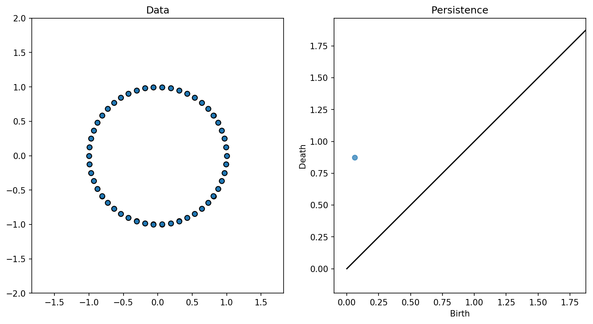{width=60%}
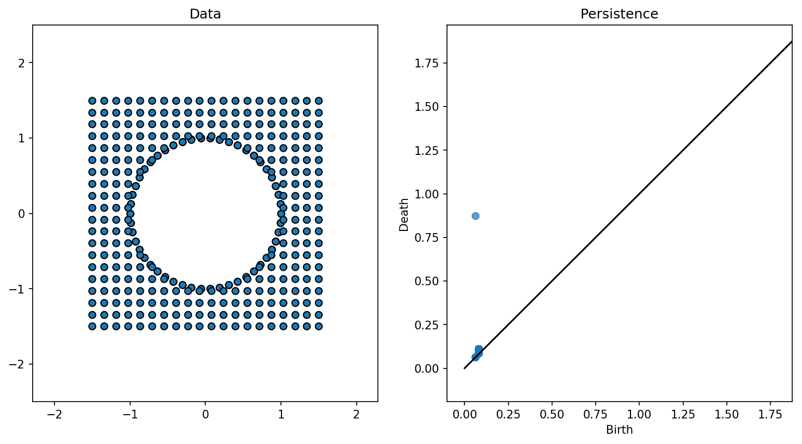{width=60%}

For the circle with outside gridding, we get some loops that are quick to be born and die, as seen by the points along the diagonal, but the main loop has identical persistence values for both sets of points.

### n-dimensional Persistent Homology

It's important to note that this methodology generalizes to $n$-dimensional Euclidean data (the balls we blow up just become spheres / hyperspheres as dimension increases, and we look for multidimensional voids enclosed by these balls rather than circles contained in a loop). However, we will not explore that further here.

### Example Use of Persistent Homology Measures with Euclidean Data

An important aspect of machine learning is
[feature extraction](https://en.wikipedia.org/wiki/Feature_extraction). The most powerful models cannot predict anything if they do not use features representative of what they are trying to predict. This raises the question, how do we generate features for geometrically complex objects? As we have demonstrated above, persistent homology offers one solution here.

As an example, we will examine the relationship between the arteries in the brain and age using the data from [this Annals of Applied Statistics paper](https://www.ncbi.nlm.nih.gov/pmc/articles/PMC5026243/pdf/nihms777844.pdf).
To start, let's first see whether we can visually distinguish younger brains from older brains:

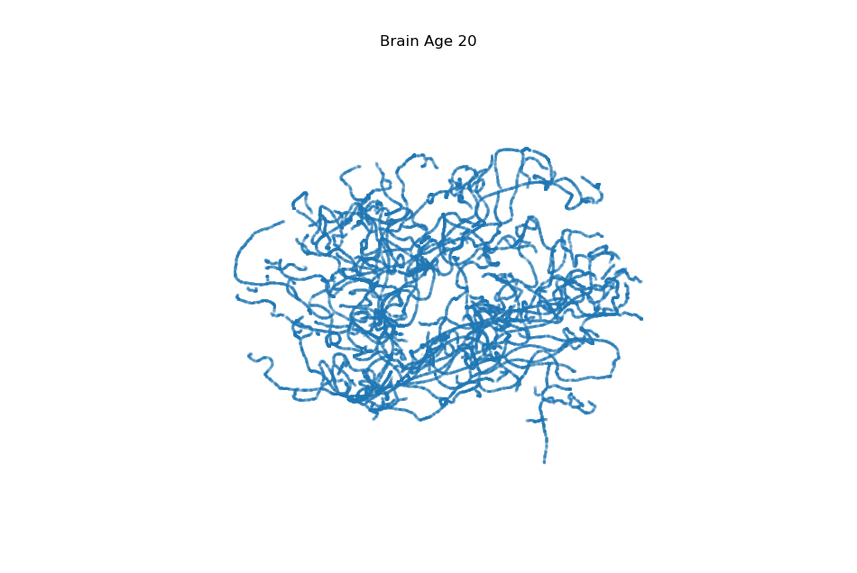{width=50%}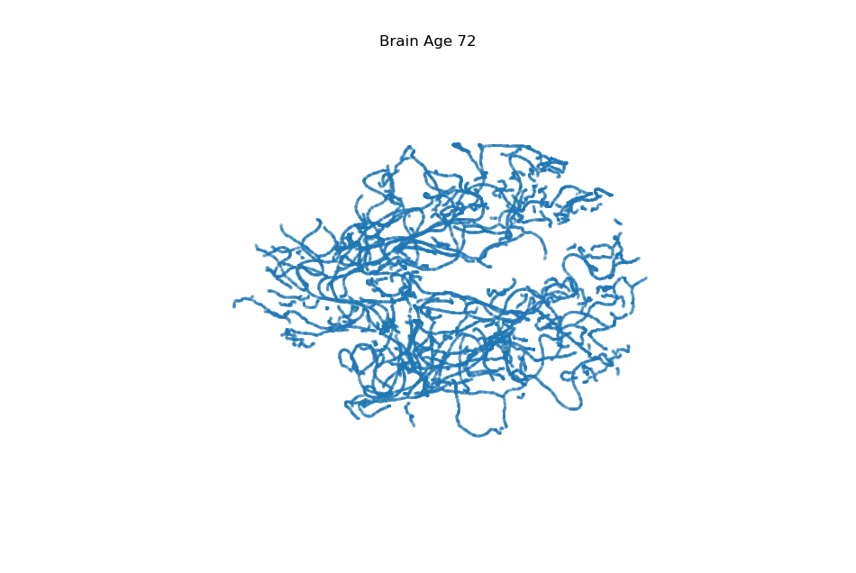{width=50%}

There do not appear to be any dramatic differences between the two brain artery trees. Let's next try to quantify these differences using 1d persistent homology:

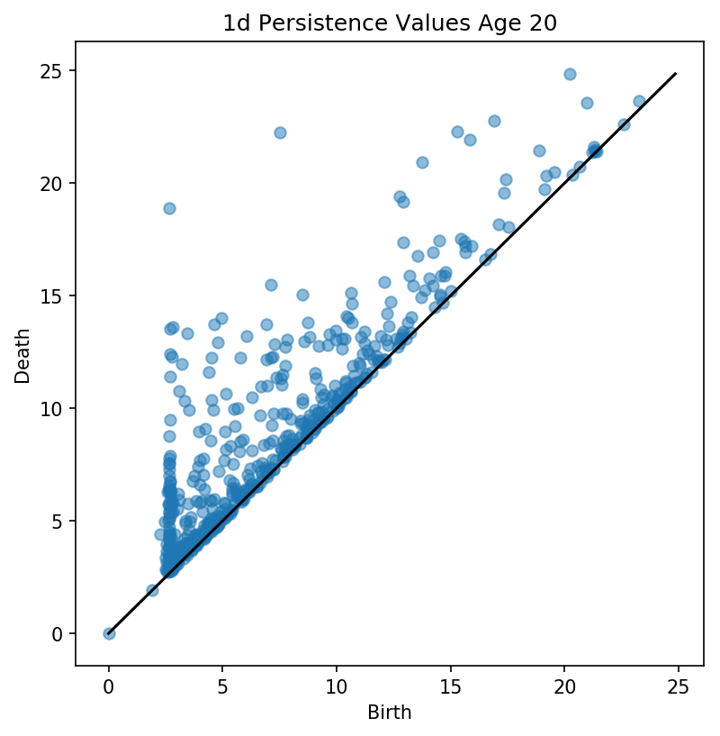{width=50%}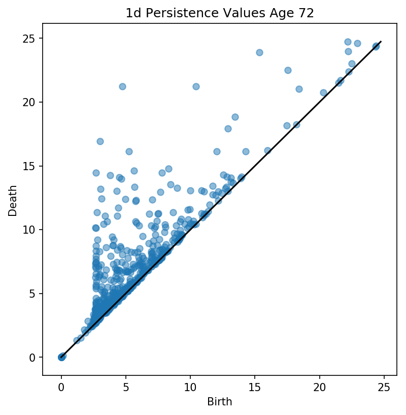{width=50%}

Again, maybe some small differences in these diagrams, but overall, they seem somewhat similar. Let's look for group differences, distinguishing younger brains from older brains as below or above age 50. Our example dataset has a total of 98 cases, which breaks into 58 cases in the younger group and 40 cases in the older group. Below are all of the 1d persistence diagrams aggregated by group:

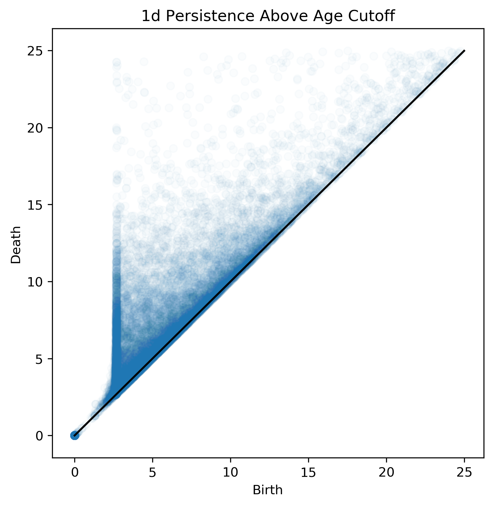{width=50%}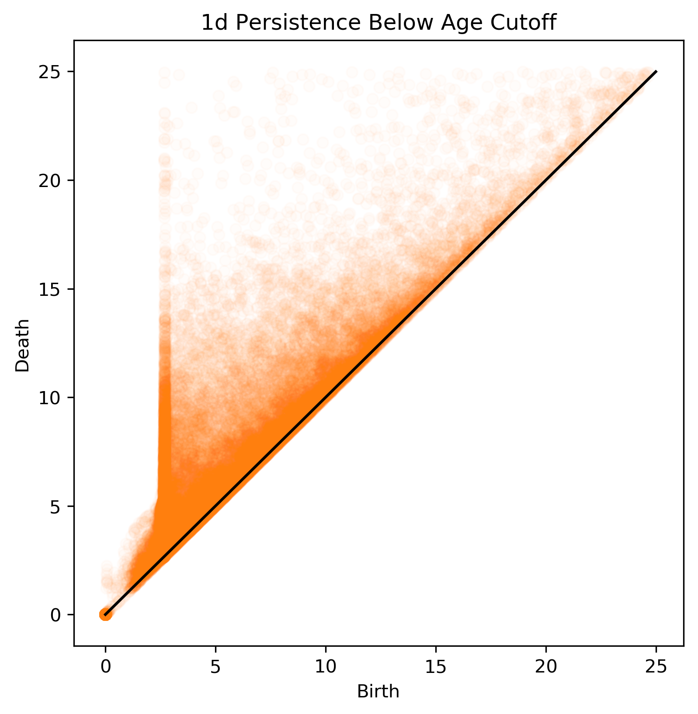{width=50%}

These figures appear to have subtle differences, but featurization here is still not immediately clear. For a more nuanced featurization of these diagrams, see [the Annals of Applied Statistics paper](https://www.ncbi.nlm.nih.gov/pmc/articles/PMC5026243/pdf/nihms777844.pdf), where their persistent homology-based features proved useful in detecting age differences in brain artery trees. As a simplification here, though, let's just consider the number of 1d persistence values:

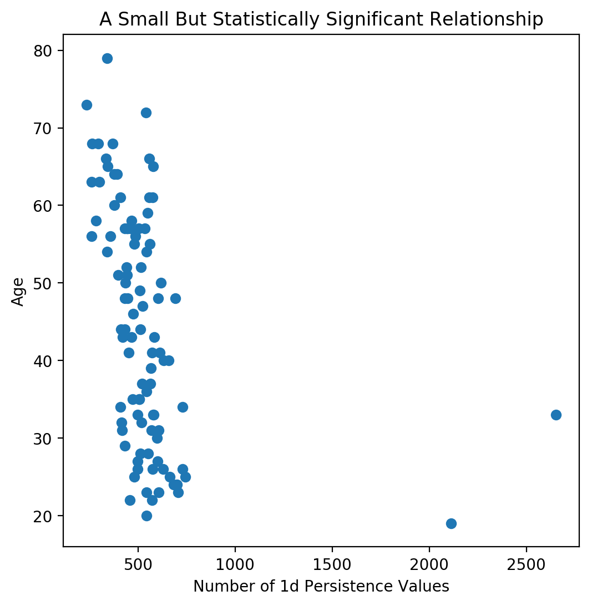{width=50%}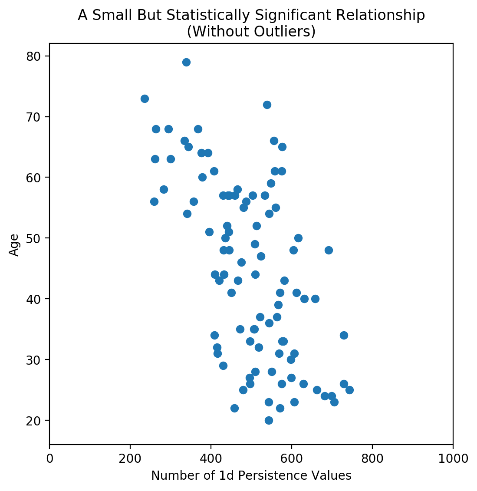{width=50%}

 

As these diagrams show, there is a subtle yet statistically significant (*p*-value $<$ 0.0005) relationship between age and number of 1d persistence values. On average, there is more looping within the brain artery trees of younger people relative to older people in our dataset. Although we do not find a strong relationship in magnitude, as techniques like [boosting](https://en.wikipedia.org/wiki/Boosting_(machine_learning)) demonstrate, an ensemble of subtle relationships can work together in machine learning to lead to impressive classification.

## Signals

With signals, we are concerned with our discrete approximation of something we would like to think of as continuous. Thus, unlike the previous discussion of persistent homology with Euclidean data, we are not interested here in how spread out the points are relative to each other with respect to the "x" distance between points. Instead, we are only concerned with the connectivity between points based on the value at each point (e.g. the "y" distance).

Like the previous 0d persistent homology discussion, we are still tracking connected components as we increase a threshold; however, blowing up balls no longer makes sense as an analogy for what we're doing, since we are unconcerned with horizontal spread between points. Instead, we can think of this as sweeping a line up over the signal, like in the diagram below:

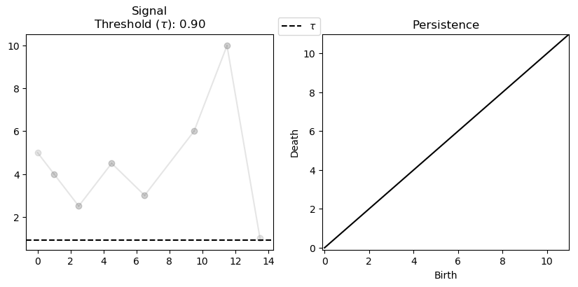{width=80%}

In this scenario, we can represent connected components of the signal with their own colors. Thus, points on the persistence diagram will correspond to the disappearance of a color, so let's discuss the connection between colors and the persistence diagram with the figure below:

{width=80%}

As we sweep the threshold up, we see we briefly have as many as three independent components (green, orange, and pink). When two of those components meet at $\tau=4.5$ (the pause in the middle of the gif), we see the orange component "dies" and a point appears for it on the persistence diagram. Signal persistent homology follows the usual precedent here; the younger connected component dies and merges into the older component. Thus, the orange component becomes green as it is now part of the green component.

As we continue to sweep up, we see no births or merges happen until we reach the global maximum of the signal. Following the usual persistent homology convention, we merge the younger component into the older component and mark a point on the persistence diagram, with pink winning out over green. Unlike Euclidean 0d persistent homology though, we created an additional point on the persistence diagram for the last surviving component. Recall with Euclidean 0d persistent homology, when the last two clusters meet, we put only one additional point on the persistence diagram. The idea with Euclidean 0d persistent homology was, as we continue to increase the size of the balls around each point, no more merges can happen, thus the collective cluster never dies. Here, we take the position that once the threshold passes the global maximum of the signal, everything has died.

Why do we choose this different practice for signals? The answer has to do with the information contained in the last persistence value. The last persistence value for a signal contains the bounds of the signal-- its birth value is the global minimum of the signal, and its death is the signal's global maximum. With Euclidean 0d persistent homology, however, we gain no additional information in recording that last point. The point is always born at $0$ and either dies at $\infty$, which reveals no information (this will be true for all datasets), or we choose for it to die when it merges with the last cluster, also revealing no information, since that would make the last persistence point a repeat of the second to last persistence point.

### Example Use of Signal Persistent Homology

An example where signal persistent homology can help us is
[compression](https://en.wikipedia.org/wiki/Data_compression).
As a specific example, we will use some toy data of a random walk with 1000 time points:

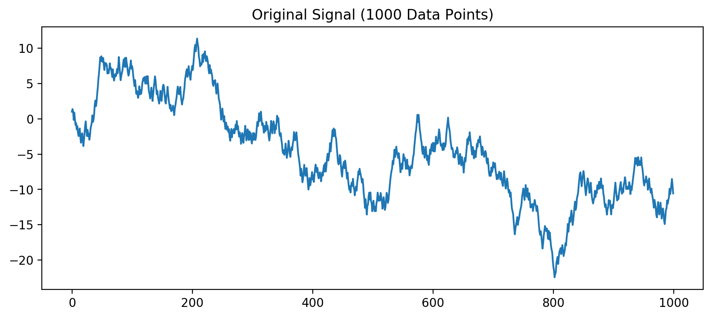{}

 

At the start, we are of course storing 1000 points. Using signal persistent homology, though, we can store less points while still pretty accurately reconstructing the signal:

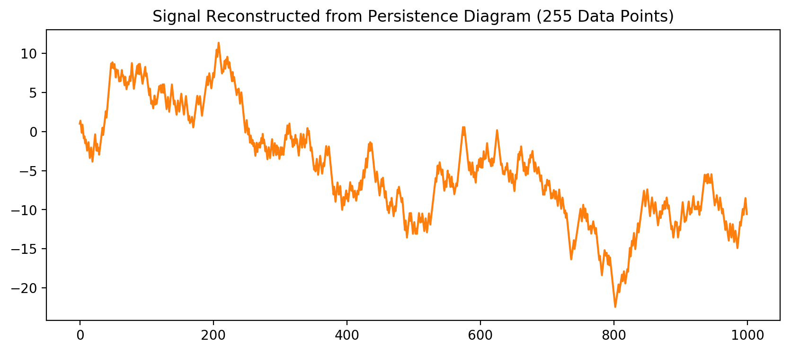{}

 

Already, we have nearly a 75% compression, and it certainly appears that our compressed signal "holds true" to the shape of the original signal, which we can emphasize by overlaying the two signals on each other:

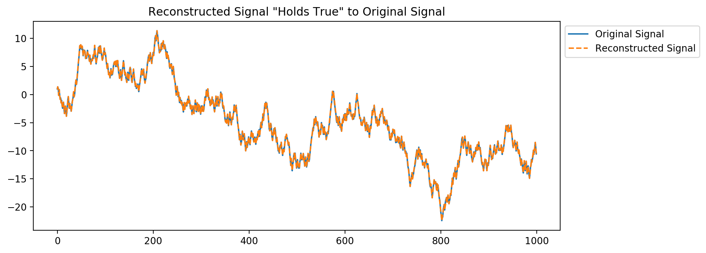{}

 

This process, however, is not perfect. We have lost some information; we just cannot see it at the full scale of the signal. Let's zoom in on a subsection of the signal:

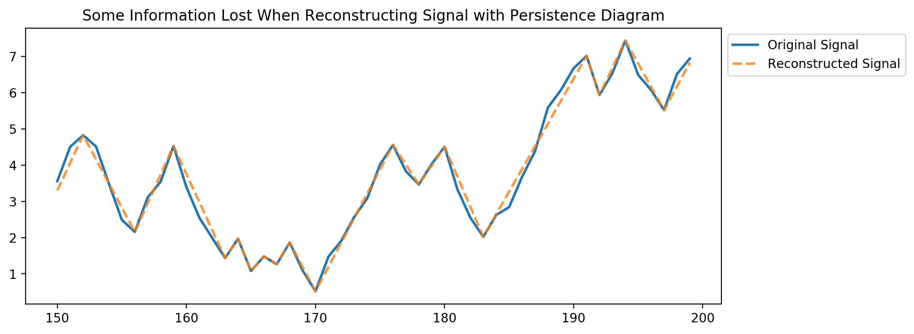{}

 

The important thing to note here is that persistent homology only preserved *critical points*, where the slope changed from positive to negative. Points where the slope changes between different positive values or between different negative values have not been preserved. This makes sense since there are no (birth, death) pairs to record at these values. Furthermore, if the interpolation between points, even between two critical points, had been non-linear, that curvature would have been lost with this compression technique (although one could store additional curvature information for a more precise but less compact compression).

Now let's consider what we would do if 75% compression was not good enough for us. Perhaps we can only transmit a small amount of data, or maybe we have a signal orders of magnitude larger. We can take advantage of persistent homology here again by choosing which persistence values to keep, namely keeping the highest persistence values and therefore prioritizing the most significant structure in the signal. Below is a demonstration showing the simplification of our returned signal as we keep fewer persistence values:

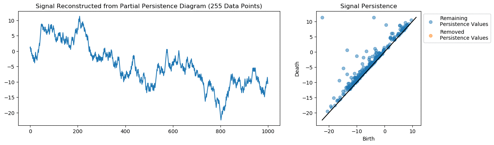{}

As we remove higher persistence values, we make increasingly drastic changes to the resulting reconstruction of the signal, but even when we store as few as roughly 50 points (a 95% compression), we maintain a decent skeleton of the signal.

## Height Filtration on Images

Persistent homology with images has a lot of similarity to signal persistent homology. Like with signal persistent homology, we are concerned with our discrete approximation of something we would like to think of as continuous. In addition, the connection between points is based on the value at each point, not the Euclidean distance between points. Finally, just as with signal persistent homology, we will be able to track births and deaths of connected components based on the "height" (e.g. color) of pixels in the image.

We will look at the following scenario:

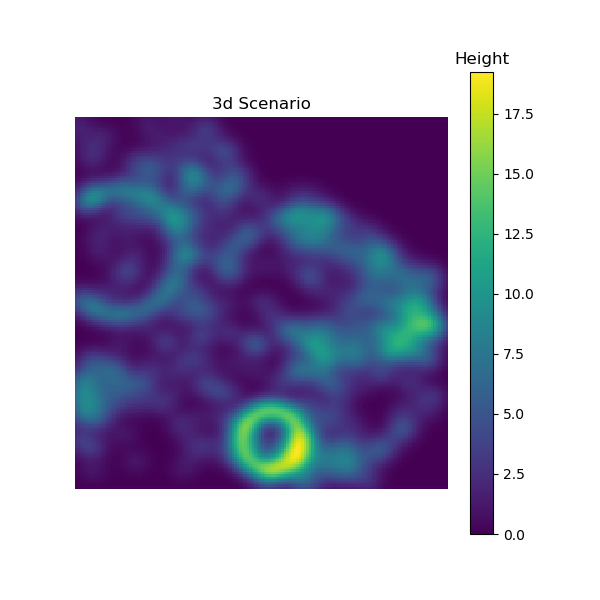{width=60%}

Or, to visually emphasize the relationship between height and color here in 3 dimensions:

{width=80%}

We sweep a threshold up like so:

{width=60%}

Or as seen in 3 dimensions:

{width=80%}

With the height filtration, as we sweep the threshold up, we track connected components, like we did in signal persistent homology. Thus, we get the following height filtration picture:

{width=50%}

### Example Use of Height Filtration

One possible use of the height filtration is
[image segmentation](https://en.wikipedia.org/wiki/Image_segmentation).

We will show an example here with wood cells:

 

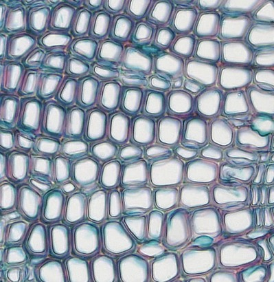{width=50%}

 

The easiest way to run a height filtration is on a single height, so we will start by converting the image from three color channels (RGB) to one. We will also blur the image to encourage this segmentation pipeline to focus on more robust features (for example, minimizing focusing on flecks of brightness at some points in the cell walls):

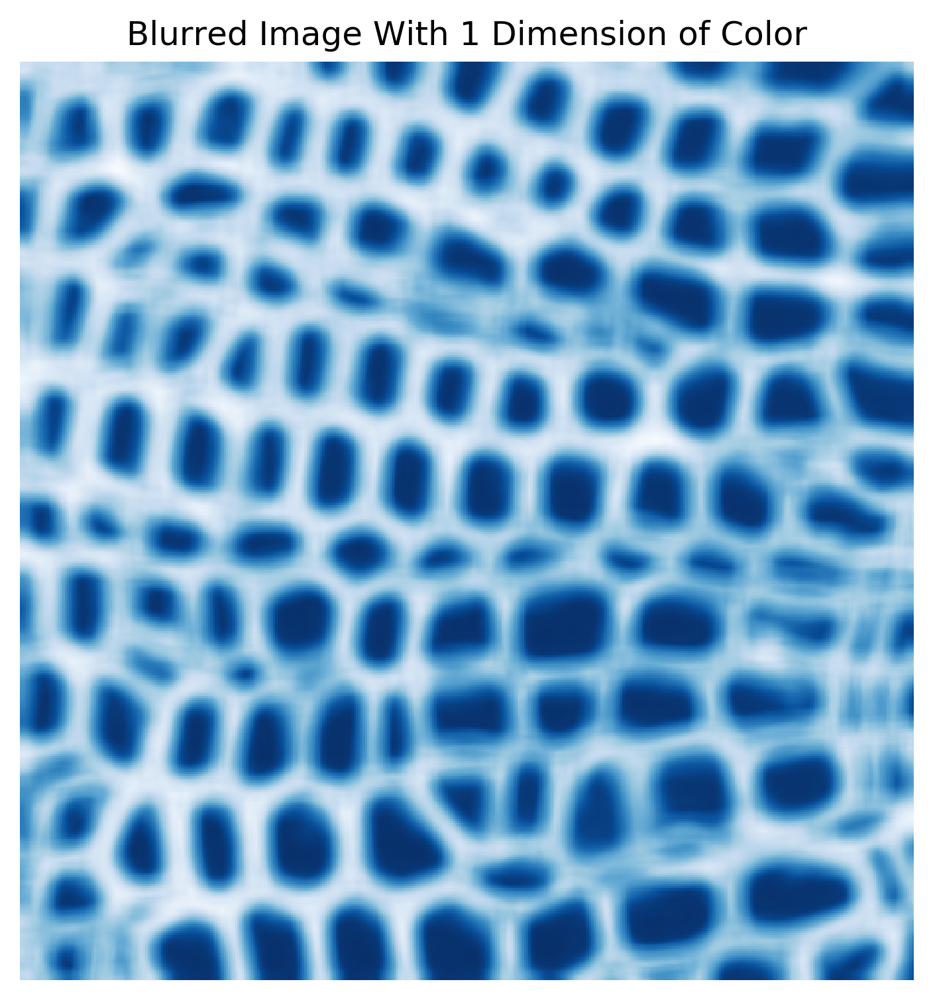{width=50%}

After we run the height filtration up to a user-specified level, we get our first sense of how well we can tease apart different cells:

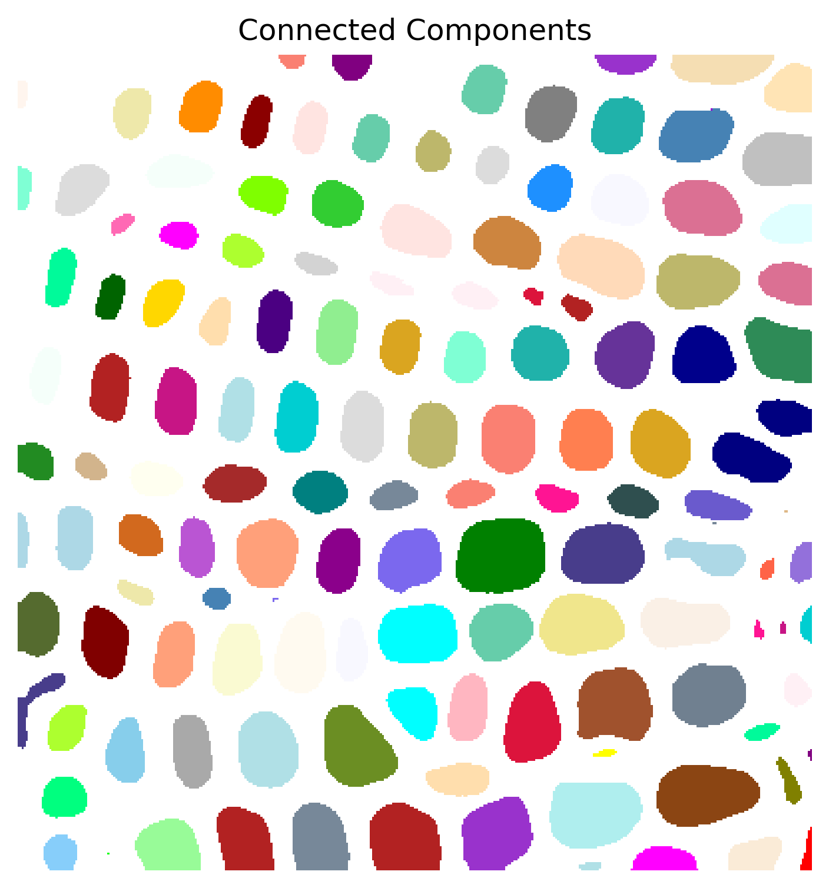{width=50%}

Looks promising! As one sanity check, let's look at the center of each connected component on top of the original image:

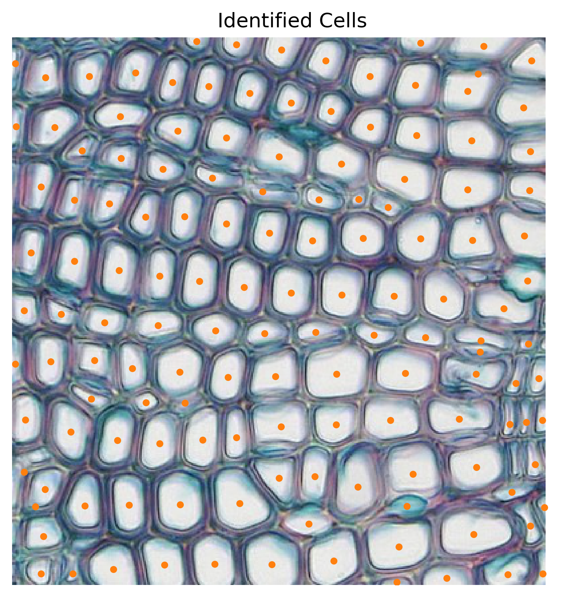{width=70%}

Our performance is excellent, but not perfect. There are a few false positives, and perhaps one or two missed cells that were particularly narrow.

As for how well we segmented the image, below is the original wood cell image with the identified pixels colored by connected component on top:

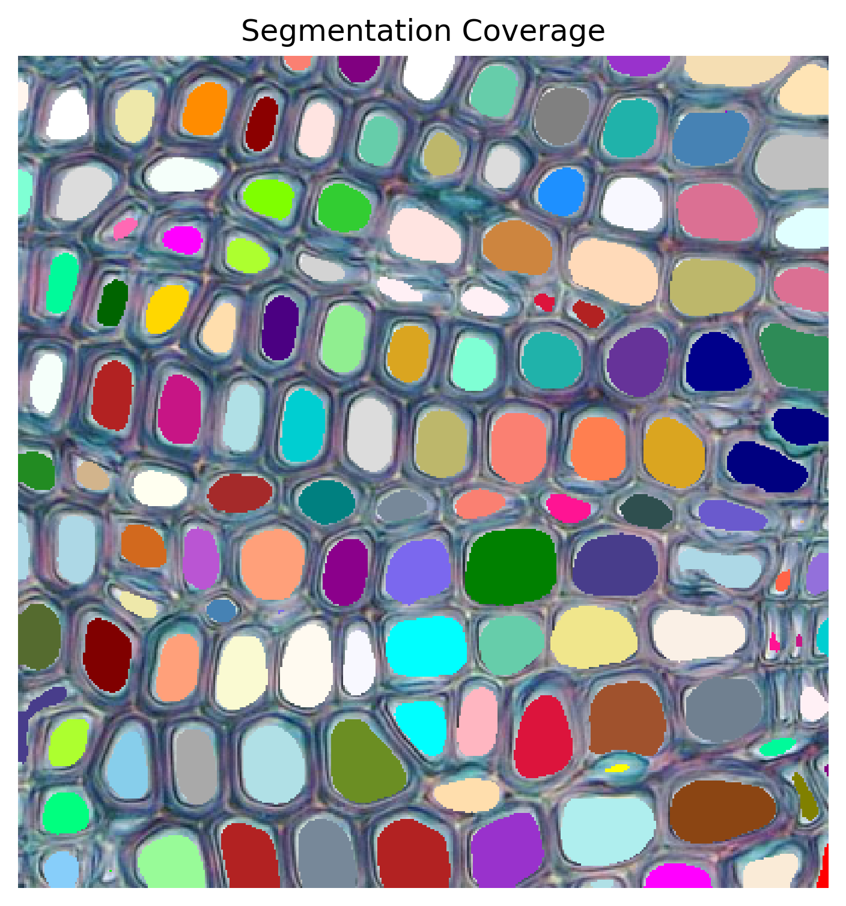{width=70%}

Our capturing of pixels within the cell walls of some of the more narrow-shaped cells was not excellent. Overall, though, we capture most of the pixels inside each cell.

It's worth emphasizing that to run this algorithm, we only needed to hand-tune two parameters, the blur parameter, and the height threshold. Furthermore, this algorithm runs quickly without any need for labeled data or a training procedure to achieve these strong results.

